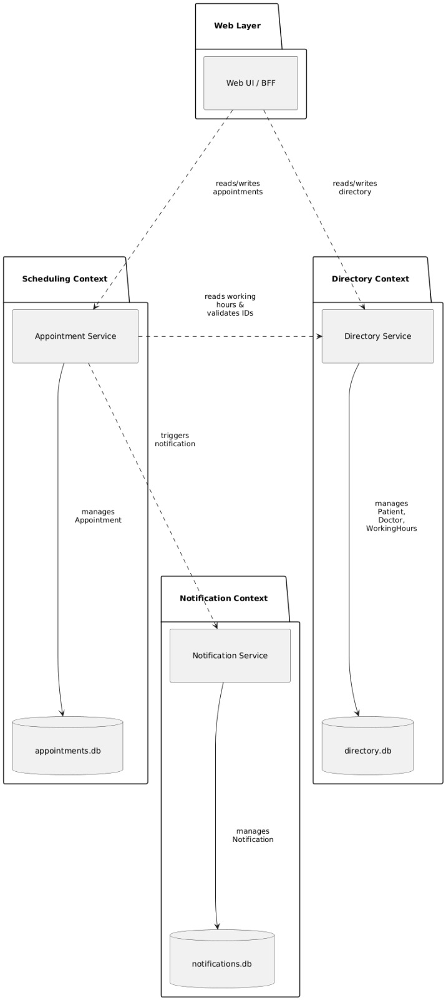

# Patient Appointment Manager 

## 1. Prezentare generală a proiectului

### 1.1 Descrierea sistemului

Patient Appointment Manager este un sistem web de dimensiune mică spre medie care permite pacienților să vizualizeze disponibilitatea medicilor și să programeze, să confirme și să anuleze programări, în timp ce medicii și administratorii gestionează programul de lucru și datele de bază ale profilului. Sistemul este implementat ca un set de servicii ușoare bazate pe Python, distribuite ca containere Docker și care comunică prin API-uri REST simple. O interfață web minimă (servită de un strat backend-for-frontend) oferă formulare și tabele pentru fluxurile uzuale de programare.

### 1.2 Obiective principale

- Oferirea unei metode simple și fiabile prin care pacienții să poată:
    - Vizualiza disponibilitatea medicilor.
    - Programa consultații noi.
    - Vizualiza și anula programările existente.
- Oferirea de instrumente pentru medici și administratori pentru a:
    - Configura și actualiza programul de lucru și intervalele de pauză.
    - Vizualiza programările viitoare și detaliile acestora.
- Menținerea unei arhitecturi curate și minimale, potrivite pentru un proiect studențesc sau de portofoliu:
    - Puține microservicii cu contexte delimitate clar.
    - Dependențe Python minime și utilizare simplă a bazei de date.
    - Distribuire bazată pe Docker fără orchestrare complexă.


### 1.3 Actori principali

- **Pacient**
    - Utilizatorul final care programează și gestionează consultații.
- **Medic**
    - Oferă disponibilitate și desfășoară consultații.
- **Administrator**
    - Gestionează programul de lucru al medicilor și configurarea de bază (de ex., orele de cabinet, durata intervalelor de programare).
- **Sistem**
    - Componente interne ale sistemului, precum microservicii și baze de date (folosite implicit în cazurile de utilizare).


### 1.4 Cerințe funcționale cheie

- Din perspectiva pacientului:
    - Vizualizarea listei de medici și a detaliilor de bază.
    - Vizualizarea disponibilității pentru fiecare medic (intervale orare) pe un interval de date ales.
    - Programarea unei consultații la medicul, data, ora și motivul alese.
    - Vizualizarea programărilor viitoare și trecute.
    - Anularea unei programări în limitele regulilor permise.
- Din perspectiva medicului/administratorului:
    - Definirea și actualizarea profilurilor medicilor (nume, specializare, contact).
    - Definirea și actualizarea programului de lucru al medicilor și a configurării intervalelor de timp.
    - Vizualizarea programărilor viitoare pentru fiecare medic.
    - Confirmarea sau respingerea programărilor (opțional, configurabil).
- Transversale:
    - Persistarea pacienților, medicilor, programului de lucru și programărilor.
    - Trimiterea unei notificări (de tip email sau bazată pe loguri) la crearea, confirmarea sau anularea unei programări.


### 1.5 Cerințe nefuncționale cheie

- **Simplitate și minimalism**: Utilizarea unui stack tehnologic minimal — Python cu un framework web ușor (Flask), SQLite pentru persistență și REST peste HTTP.
- **Distribuire**: Toate componentele rulează în containere Docker, orchestrate prin Docker Compose; fără Kubernetes sau service mesh extern.
- **Performanță**: Adecvată pentru trafic redus spre mediu, tipic unui proiect studențesc; fără constrângeri hard real-time. Flask și SQLite sunt suficiente pentru astfel de API-uri la scară mică.
- **Fiabilitate**: Tratare de bază a erorilor și validare pentru a preveni programările inconsistente (de ex., rezervarea dublă a unui interval).
- **Securitate**: Autentificare simplă (de ex., nume de utilizator/parolă cu sesiune sau JWT) pentru separarea accesului pacientului de cel al medicului/administratorului; se presupune că terminarea HTTPS este gestionată extern într-un mediu similar producției.
- **Mentenabilitate**: Limite clare între servicii, cod Python lizibil și structură de repository simplă.

***

## 2. Modelul cazurilor de utilizare

### 2.1 Cazuri principale de utilizare (textual)

- **UC1 – Vizualizare listă medici**
    - Actor: Pacient
    - Descriere: Pacientul vizualizează toți medicii cu informații de bază (nume, specializare) și selectează unul pentru a-i inspecta disponibilitatea sau pentru a face o programare.
- **UC2 – Vizualizare disponibilitate medic**
    - Actori: Pacient, Medic
    - Descriere: Pacientul (sau medicul) vizualizează intervalele disponibile pentru un medic selectat într-o fereastră de timp specificată, pe baza programului de lucru configurat și a programărilor existente.
- **UC3 – Programare consultație**
    - Actor: Pacient
    - Descriere: Pacientul selectează un medic și un interval disponibil, apoi trimite detaliile programării (motiv, note opționale). Sistemul validează disponibilitatea intervalului și creează o programare în stare în așteptare sau confirmată.
- **UC4 – Confirmare programare**
    - Actori: Medic, Administrator
    - Descriere: Medicul sau administratorul confirmă programările în așteptare. Starea confirmării este stocată și este declanșată o notificare.
- **UC5 – Anulare programare**
    - Actori: Pacient, Medic, Administrator
    - Descriere: Pacientul, medicul sau administratorul anulează o programare existentă în limitele regulilor permise. Starea de anulare este stocată, iar notificarea este declanșată.
- **UC6 – Vizualizare programări**
    - Actori: Pacient, Medic
    - Descriere: Pacientul își vizualizează propriile programări; medicul vizualizează programările alocate lui, filtrate după stare și interval de date.
- **UC7 – Gestionare profil medic**
    - Actori: Administrator, Medic (pentru propriul profil)
    - Descriere: Administratorul (sau medicul pentru câmpurile limitate) creează și actualizează profilurile medicilor, inclusiv specializarea, informațiile de contact și starea activă.
- **UC8 – Gestionare program de lucru medic**
    - Actor: Administrator
    - Descriere: Administratorul configurează programul zilnic de lucru, durata intervalelor și perioadele de pauză pentru fiecare medic. Aceste informații sunt utilizate de serviciul de programări pentru a calcula disponibilitatea.
- **UC9 – Gestionare pacienți**
    - Actor: Administrator
    - Descriere: Administratorul înregistrează și menține informațiile de bază ale pacienților (nume, contact, note opționale).
- **UC10 – Primire notificări programare**
    - Actori: Pacient, Medic
    - Descriere: Când programările sunt create, confirmate sau anulate, serviciul de notificări trimite un mesaj de tip email (sau loguri) către pacientul și medicul relevanți.


### 2.2 Diagrama cazurilor de utilizare


***

## 3. Modelul de domeniu și bounded contexts

### 3.1 Entități principale de domeniu și relații


**Entități**

- **Patient**
    - Atribute: `patient_id`, `full_name`, `email`, `phone`, `created_at`, `updated_at`.
    - Relații: are mai multe înregistrări `Appointment`.
- **Doctor**
    - Atribute: `doctor_id`, `full_name`, `specialization`, `email`, `phone`, `active`, `created_at`, `updated_at`.
    - Relații: are mai multe înregistrări `Appointment`; are mai multe înregistrări `DoctorWorkingHours`.
- **DoctorWorkingHours**
    - Atribute: `working_hours_id`, `doctor_id`, `weekday` (0–6), `start_time`, `end_time`, `slot_length_minutes`, `break_start_time` (nullable), `break_end_time` (nullable).
    - Relații: aparține lui `Doctor`.
- **Appointment**
    - Atribute: `appointment_id`, `patient_id`, `doctor_id`, `start_datetime`, `end_datetime`, `status`, `reason`, `created_at`, `updated_at`.
    - Relații: aparține lui `Patient`, aparține lui `Doctor`.
- **Notification**
    - Atribute: `notification_id`, `recipient_type` (patient/doctor), `recipient_id`, `channel` (email/log), `subject`, `body`, `status` (pending/sent/failed), `created_at`, `sent_at` (nullable).
    - Relații: poate face referire la un `Appointment` (cheie externă opțională).

**Obiecte de valoare**

- **TimeSlot**
    - Atribute: `start_datetime`, `end_datetime`.
    - Utilizare: Calculat, nu este persistat independent; utilizat în calculul disponibilității.
- **AppointmentStatus**
    - Valori permise: `PENDING`, `CONFIRMED`, `CANCELLED`.
- **NotificationStatus**
    - Valori permise: `PENDING`, `SENT`, `FAILED`.

**Rezumatul relațiilor (textual)**

- Un `Patient` poate avea zero sau mai multe înregistrări `Appointment`.
- Un `Doctor` poate avea zero sau mai multe înregistrări `Appointment`.
- Un `Doctor` poate avea zero sau mai multe înregistrări `DoctorWorkingHours` care descriu modele săptămânale.
- Fiecare `Appointment` face referire exact la un `Patient` și un `Doctor`.
- O `Notification` este asociată cu un singur destinatar logic și poate fi asociată cu un `Appointment`.


### 3.2 Bounded contexts




Pentru a păstra sistemul ușor de înțeles la un nivel potrivit pentru un proiect studențesc/de portofoliu, definim trei bounded contexts și mapăm fiecare la un microserviciu.

1. **Contextul Directory**
    - Domeniu: Gestionarea `Patient`, `Doctor` și `DoctorWorkingHours`.
    - Responsabilități:
        - CRUD pentru pacienți și medici.
        - CRUD pentru programul de lucru al medicilor și configurare.
    - Garanții:
        - Consistența internă a datelor legate de persoane și a programului de lucru.
    - Microserviciu: **Directory Service**.
2. **Contextul Scheduling**
    - Domeniu: Gestionarea programărilor și calculul disponibilității.
    - Responsabilități:
        - Gestionarea ciclului de viață al `Appointment` (creare, confirmare, anulare).
        - Calcularea disponibilității din `DoctorWorkingHours` (prin apeluri API către Directory Service) și a programărilor existente.
    - Garanții:
        - Fără rezervare dublă a intervalelor de timp.
        - Tranziții valide ale stării (de ex., nu se poate confirma o programare anulată).
    - Microserviciu: **Appointment Service**.
3. **Contextul Notification**
    - Domeniu: Livrarea notificărilor legate de programări.
    - Responsabilități:
        - Gestionarea entităților `Notification` și trimiterea mesajelor.
        - Oferirea unei interfețe API simple pentru ca alte servicii să declanșeze notificări.
    - Garanții:
        - Cel puțin o încercare de trimitere a unei notificări pentru fiecare cerere (pentru acest scop, o abordare simplă best-effort este acceptabilă).
    - Microserviciu: **Notification Service**.

În plus, există o componentă **Web UI / Backend-for-Frontend (BFF)**:

- Domeniu: Servește interfața HTML (sau un SPA foarte subțire) și agregă date din serviciile backend.
- Responsabilități:
    - Implementarea ecranelor pentru pacient, medic și administrator folosind apeluri simple către microservicii.
    - Gestionarea autentificării utilizatorului (sesiune sau JWT) într-un mod minimal.

### 3.3 Maparea bounded contexts la servicii

- **Directory Context → Directory Service**
    - Deține `patients.db` (SQLite) și `doctors.db` (sau un singur `directory.db`).
    - Expune endpoint-uri REST pentru pacienți, medici și programul de lucru.
    - Appointment Service și Web UI citesc din acest serviciu.
- **Scheduling Context → Appointment Service**
    - Deține `appointments.db`.
    - Expune endpoint-uri REST pentru:
        - Gestionarea programărilor.
        - Calcularea intervalelor disponibile prin combinarea programului de lucru din Directory Service cu propriile programări.
- **Notification Context → Notification Service**
    - Deține `notifications.db`.
    - Expune endpoint-uri REST pentru a primi cereri de notificare din partea Appointment Service (și opțional Directory Service).
    - Implementează trimiterea efectivă sub formă de email/log stub pentru a menține dependențele minime.
- **Web Frontend (BFF)**
    - Nu deține domeniul principal; poate avea o mică bază de date locală pentru gestionarea sesiunii, dacă se dorește.
    - Orchestrază apelurile către serviciile Directory, Appointment și Notification.
    - Implementat ca o aplicație Flask ușoară.

Această descompunere urmează o separare în stil DDD în jurul unor modele natural coezive (directory, scheduling, notifications), păstrând în același timp numărul de microservicii redus și responsabilitățile clare.

***

## 4. Microservicii

<table style="width: 100%; border: 1px solid; font-size: 1.5em; font-weight: bold">
  <thead>
    <tr style="text-align: center">
      <th>Web & BFF</th>
      <th>Programări</th>
      <th>Directory</th>
      <th>Notificări</th>
    </tr>
  </thead>
</table>

În total avem 4 microservicii care au un scop concret și o delimitare funcțională rigidă astfel încât fiecare să se ocupe de un aspect important al aplicației.

### 4.1 Microserviciul Web & BFF

Acesta coagulează toate microserviciile pentru a afișa datele aferente programărilor pentru pacienți, și apelarea fiecărui microserviciu pentru declanșarea acțiunilor. El servește șabloane HTML către client, și formează apelurile către API-uri pentru a întocmi funcționalitatea în interfață.

### 4.2 Responsabilități și limite

1. Compunerea și afișarea șabloanelor Jinja pentru interfața cu utilizatorul.
2. Managamentul sesiunilor
3. Apelarea API-urilor aferente conform interfeței.
4. Nu persistă date despre modelul domeniu: pacienți, doctori, programări. Toate acestea provin de la microservicii.

### 4.3 Descrierea API-ului

- Protocol de acces: REST over HTTP (JSON payload)
- Puncte de acces:
  - `GET /` - pagina de autentificare, ulterior dashboard cu toate datele relevante pentru doctori, pacienți și admin după caz, după autentificare
  - `POST /login` - acțiune de autentificare
    - BODY: `{ email: "...", password: "..." }`
  - `GET /patient/doctors` - pagina pentru listarea doctorilor pentru pacienți
  - `GET /patient/doctors/{doctor_id}/availability` - pagina pentru afișarea calendarului pentru doctorul cu ID-ul `doctor_id`.
  - `GET /doctor/appointments` - pagina pentru listarea tuturor programărilor unui doctor
  - `GET /admin/doctors` - pagina pentru listarea tuturor doctorilor de către admin
  - `GET /admin/doctors/{doctor_id}/hours` - pagina pentru vizualizarea orarului unui doctor cu ID-ul `doctor_id` de către admin

### 4.4 Structura bazei de date

Microserviciul acesta controlează baza de date `web.db`. Această bază de date conține o singură tabelă care controlează utilizatorii pentru a putea identifica pe cei care sunt autentificați prin intermediul mecanismului de sesiuni.

Toate coloanele se auto-explică. Coloana `entity_id` deține id-ul utilizatorului în cadrul rolului său. Pentru un doctor, `entity_id` va conține ID-ul doctorului logat.

- `users`
  - `id` INTEGER PRIMARY KEY NOT NULL
  - `entity_id` INTEGER FOREIGN KEY NOT NULL
  - `password` TEXT NOT NULL
  - `role` ENUM NOT NULL ("pacient" | "doctor" | "admin")
  - `created_at` TEXT NOT NULL
  - `updated_at` TEXT NOT NULL

### 4.5 Tehnologii folosite

- Python
- Flask pentru randarea șabloanelor și servirea de conținut către utilizator
- Jinja2 pentru sistemul de templating
- `request` pentru apelurile către celelalte microservicii

## 4.6 Microserviciul Appointments

Acesta este microserviciul care se ocupă cu stabilirea de programări între pacient și doctor, și care determină ulterior orarul și disponibilitatea doctorilor. În cadrul acestui serviciu se crează noi programări, se confirmă sau refuză programări existente, și se listează programările în funcție de doctor, pacient sau dată.

Deoarece conține logica de calculare a disponibilității pe doctor, acesta cere orarul doctorului de la microserviciul Directory, și se folosește de programările pe care le deține pentru a calcula disponibilitatea.

#### Responsabilități și limite

1. Controlează agregarea de programări, și controleaza regulile disponibilității pe loc, și tranzițiile de stare ale acestora.
2. Nu deține date despre pacient sau doctor. Le preia de la microserviciul Directory, deținând doar referințe de tip ID către doctori și pacienți.
3. Declanșeaza o nouă notificare prin microserviciul pentru notificări atunci când o programare este creată, acceptată sau refuzată.

### 4.7 Descrierea API-ului

- Protocol de acces: Rest over HTTP (JSON payload)
- Puncte de acces:
  - `GET /appointments` - întoarce o listă de programări
    - Parametri query: `patient_id`, `doctor_id`, `date_from`, `date_to`
  - `POST /appointments` - acțiune de creare a unei programări
    - BODY: `{ "patient_id": ..., "doctor_id": ..., "start_datetime": "...", "end_datetime": "...", "reason": "..." }`
  - `GET /appointments/{appointment_id}` - întoarce datele despre o anumită programare
  - `PATCH /appointments/{appointment_id}` - alterează starea unei programări
    - BODY: `{ "status": "CONFIRMED" }` sau `{ "status": "CANCELLED" }`
  - `GET /availability` - întoarce o listă de date și ore disponibile pentru programări
    - Parametri query: `doctor_id`, `date_from`, `date_to`

### 4.8 Structura bazei de date

Deține control total asupra bazei de date `appointments.db`. Această bază de date conține date despre programări, și stările lor.

- `appointments`
  - `appointment_id` INTEGER PRIMARY KEY
  - `patient_id` INTEGER FOREIGN KEY NOT NULL
  - `doctor_id` INTEGER FOREIGN KEY NOT NULL
  - `start_datetime` TEXT NOT NULL
  - `end_datetime` TEXT NOT NULL
  - `status` ENUM NOT NULL ("pending" | "accepted" | "rejected")
  - `reason` TEXT
  - `created_at` TEXT NOT NULL
  - `updated_at` TEXT NOT NULL

### 4.9 Tehnologii folosite

- Python
- Flask pentru rutarea HTTP routing și gestionarea JSON
- `sqlite3` pentru interogarea și gestionarea bazei de date
- `requests` pentru a apela microserviciul Directory pentru a obține date despre doctori și pacienți

## 5. Microserviciul Directory

Se ocupă cu gestionarea de informații de bază despre pacienți, doctori, orarele doctorilor și configurările de timp liber.

### 5.1 Responsibilities și limite

1. Deține entitățile `Patient`, `Doctor`, și `DoctorWorkingHours`
2. Se asigură că doctorii și pacienții ceruți de celelalte microservicii există și sunt activi în sistem
3. Nu se ocupă cu notificări sau cu gestionarea programărilor

### 5.2 Descrierea API-ului

- Protocol de acces: REST over HTTP (JSON payload)
- Puncte de acces:
- Pacienți:
  - `GET /patients` - listează pacienții
  - `POST /patients` - crează un pacient
    - BODY: `{ full_name: "...", "email": "...", "phone": "..." }`
  - `GET /patients/{patient_id}` - întoarce detalii despre un anume pacient
  - Doctori:
    - `GET /doctors` - listează doctorii
    - `POST /doctors` - crează un doctor
    - `GET /doctors/{doctor_id}` - întoarce detalii despre un anume doctor
    - `PATCH /doctors/{doctor_id}` - actualizează date despre doctor
  - Orar:
    - `GET /doctors/{doctor_id}/working-hours` - întoarce orarul unui anume doctor
    - `POST /doctors/{doctor_id}/working-hours` - crează un orar pentru un doctor
      - BODY: `{ "weekday": "...", "start_time": "...", "end_time": "...", "slot_length_minutes": "...", "break_start_time": "...", "break_end_time": "..." }`
    - `PATCH /doctors/{doctor_id}/working-hours` - modifică anumite date despre un anumit orar al unui doctor
    - `DELETE /doctors/{doctor_id}/working-hours` - șterge orarul de pe o zi al unui doctor

  - `POST /admin` - crează un admin
    - BODY: `{ "first_name": "...", "last_name": "...", "email": "...", "password": "..." }`
  - `PATCH /admin/{admin_id}` - modifică datele unui admin
  - `DELETE /admin/{admin_Id}` - șterge un admin

### 5.3 Structura bazei de date

Acest microserviciu are control complet asupra bazei de date `directory.db` unde se stochează datele despre pacienți, doctori, admini și orarul unui doctor.

- `patients`
  - `id` INTEGER PRIMARY KEY
  - `full_name` TEXT NOT NULL
  - `email` TEXT NOT NULL
  - `phone` TEXT
- `doctors`
  - `id` INTEGER PRIMARY KEY
  - `full_name` TEXT NOT NULL
  - `specialization` TEXT
  - `email` TEXT NOT NULL
  - `phone` TEXT
  - `active` BOOL NOT NULL
- `admins`
  - `id` INTEGER PRIMARY KEY
  - `full_name` TEXT NOT NULL
  - `email`: TEXT NOT NULL
- `doctor_working_hours`
  - `id` INTEGER PRIMARY KEY
  - `doctor_id` INTEGER FOREIGN KEY NOT NULL
  - `weekday` INTEGER NOT NULL
  - `start_time` TEXT NOT NULL
  - `end_time` TEXT NOT NULL
  - `slot_length_minutes` INTEGER NOT NULL
  - `break_start_time` TEXT
  - `break_end_time` TEXT
  - `created_at` TEXT NOT NULL
  - `updated_at` TEXT NOT NULL

### 5.4 Tehnologii folosite

- Python
- `sqlite3` pentru interogarea și gestionarea bazei de date
- Flask pentru rutare HTTP și geestionarea punctelor de acces

## 6. Microserviciul Notifications

Microserviciul acesta are unica responsabilitate de a trimite notificări cu privire la evenimentele despre programări. Atunci când statusul unei programări se trimite, actorul aferent este notificat în aplicație.

### 6.1 Responsabilități și limite

1. Deține entitatea `Notification` și statusurile sale.
2. Controlează ce notificări trebuie afișate pentru pacient sau doctor.
3. Nu se ocupă cu logica de business pentru programări, sau stocare de date importante. Este un sistem reactiv menit pentru înștiințări cu privire la schimbarea unui status al unei programări.

### 6.2 Descrierea API-ului

- Protocol de acces: REST over HTTP (JSON payload)
- Puncte de acces:
  - `POST /notifications` - crearea unei notificări
    - BODY: `{ "recipient_type": "patient"|"doctor", "recipient_id": "...",subject": "...", "body": "..." }`
  - `GET /notifications` - listarea notificărilor pentru un actor
    - Parametri query: `recipient_type`, `recipient_id`,
  - `PATCH /notification/{notification_id}` - actualizarea statusului de vizualizare pentru o anumită notificare pentru a împiedica afișarea notificărilor vechi

### 6.3 Structura bazei de date

Deține controlul bazei de date `notifications.db` unde se stochează notificările și statusurile de vizualizare a acestora.

- `notifications`
  - `id` INTEGER PRIMARY KEY
  - `recipient_type` ENUM NOT NULL ("pacient" | "doctor")
  - `recipient_id` INTEGER FOREIGN KEY NOT NULL
  - `subject` TEXT NOT NULL
  - `body` TEXT NOT NULL
  - `status` TEXT NOT NULL 
  - `created_at` TEXT NOT NULL
  - `updated_at` TEXT NOT NULL

### 6.4 Tehnologii folosite

- Python
- Flask pentru rutarea HTTP și gestionarea punctelor de acces

## 6. Arhitectura Sistemului

Arhitectura este construită pe principiile **Domain-Driven Design (DDD)**. Această metodologie arhitecturală nu tratează sistemul
ca pe o singură bază de date masivă înconjurată de logică de aplicație;
în schimb, împarte problema de business în **Contexte Delimitate** strict definite.
Fiecare context își încapsulează propriile reguli de business,
propriul model de date și propria logică de validare.
Această decizie de proiectare este clar vizibilă în diagramele de context
și de componente,
unde sistemul este împărțit în servicii individuale: 
Directory Service, Appointment Service, Notification Service 
și o interfață de tip **Backend-for-Frontend (BFF)**.

### 6.1 Analiza contextelor

Diagramele de context, și documentația generală a proiectului,
arată o împărțire a domeniului de business din backend,
protejată de un strat de orchestrare frontend. 
Această compartimentare reflectă liniile de separare ale
proceselor operaționale dintr-o clinică medicală.


#### 6.1.1 Contextul Directory

Primul context este reprezentat de **Directory Context**, controlat de
**Directory Service**. 
Acest modul funcționează ca sistemul principal de evidență
pentru toate datele master ale platformei. Deține control
absolut asupra ciclului de viață al profilurilor pacienților, medicilor și 
definițiilor programelor de lucru și ale perioadelor de pauză alocate
profesioniștilor medicali.

Din perspectivă arhitecturală, Directory Service este complet independent,
nu apelează nicio altă componentă a sistemului pentru a-și îndeplini 
funcțiile de bază. Această asimetrie a dependențelor 
asigură că datele demografice și operaționale de bază rămân disponibile 
chiar și în scenariile în care sistemul de programare întâmpină dificultăți
tehnice temporare.

#### 6.1.2 Contextul Appointments

Al doilea context, și cel mai complex din punct de vedere al logicii tranzacționale,
este **Appointment Context**, gestionat de **Appointment Service**. 
Această componentă este motorul operațional al sistemului, 
cu responsabilitatea exclusivă de a gestiona ciclul de viață al unei programări.

Appointment Service nu stochează o copie a numelui pacientului sau
a specializării medicului. În schimb, stochează doar identificatori numerici 
(chei de referință). Pentru a compune o imagine completă a disponibilității
sau pentru a afișa un calendar, acest serviciu funcționează ca un
client activ, și execută cereri HTTP către Directory Service
pentru a prelua dinamic informații necesare. Acest mecanism previne
anomaliile de actualizare, dacă un medic își schimbă numărul de telefon, 
modificarea este reflectată instantaneu în toate programările 
viitoare fără a necesita sincronizări masive ale bazelor de date.

#### 6.1.3 Contextul Notification

Al treilea context este **Notification Context**, operat de **Notification Service**.
Acest modul izolează logica de alertare asincronă și acționează ca
receptor de comenzi. Când în sistem au loc evenimente de business 
semnificative (crearea, confirmarea sau anularea unei programări), 
Appointment Service generează o sarcină și o transmite către acest context.

#### 6.1.4 Contextul Web & BFF

În final, **Web Layer**, implementat ca model 
**Backend-for-Frontend (BFF)**, servește drept interfață unificatoare.
Într-o arhitectură descentralizată, expunerea directă a
microserviciilor către browserul clientului ar genera haos comunicațional,
și ar putea expune detalii ale infrastructurii interne. BFF preia acest rol de unificare.

Acesta utilizează motorul
de template-uri **Jinja2** pentru a reda interfețe HTML,
și agregă simultan date din programări și din director
în structuri de date coerente înainte de a le prezenta
utilizatorului. Acest strat gestionează sesiunile utilizatorilor, autentificarea și accesul pe roluri, 
separând strict privilegiile dintre pacienți, medici și administratori.

### 6.2 Modelarea datelor

Contrar practicilor monolitice care folosesc un server centralizat masiv de baze de date 
(de ex., o singură instanță PostgreSQL sau MySQL), 
sistemul implementează un model strict de o bază de date per serviciu. 
Această izolare garantează că granițele sunt impenetrabile
la nivelul fizic al datelor.


Tehnologia selectată pentru acest strat de persistență este **SQLite**. Alegerea SQLite are o importanță strategică majoră pentru îndeplinirea cerințelor de "Deployability" și "Simplicity". Fiind o bază de date serverless, bazată pe fișiere, SQLite elimină complet necesitatea instalării, configurării, securizării și monitorizării unui daemon separat. Toată logica bazei de date este procesată de o bibliotecă C integrată direct în procesul aplicației Python.

Deși această arhitectură introduce limitări privind scrierile concurente masive (din cauza mecanismului de blocare la nivel de fișier al SQLite), ea este perfect calibrată pentru un sistem de management al programărilor medicale cu volume de trafic mici până la medii, unde operațiile de citire domină categoric operațiile de scriere.

#### 6.2.1 Schema bazei de date


#### 6.2.2 Relații fizice vs. logice

În cadrul `directory.db`, există o linie continuă marcată "FK constraint" între tabelele `doctors` și `doctor_working_hours`. Acest lucru indică utilizarea unei constrângeri SQLite FOREIGN KEY la nivelul bazei de date, garantând că nu poate fi inserat niciun program pentru un medic inexistent și că ștergerea unui medic va declanșa o eroare sau o ștergere în cascadă.

În schimb, liniile care conectează tabelul `appointments` cu `doctors` și `patients`
sunt întrerupte și marcate ca "Logical relation" sau "Logical FK". 
Deoarece `appointments` se află într-un fișier separat fizic (`appointments.db`), 
motorul bazei de date SQLite nu are capacitatea de a impune referințe între fișiere.
Acest lucru mută responsabilitatea menținerii integrității referențiale de la baza
de date la stratul aplicației.

### 6.3 Coregrafia API-urilor

Diagramele de rețea indică utilizarea exclusivă a HTTP pentru transferul stării
în format JSON, cu endpoint-uri REST organizate logic sub un prefix
comun de versiune: `REST /api/v1`. 

#### 6.3.1 Secvența de creare a unei programări

Diagrama de secvență dedicată fluxului de creare a unei programări 

%204.2.jpg)

### 6.4 Ciclul de viață al programării

%203.1%203.2.jpg)

Orice interacțiune de creare a unei programări inițializează obiectul în starea
**`PENDING`** (În așteptare). Această stare reprezintă o intenție despre 
care încă nu s-a primit aprobarea de la un doctor.
Din acest punct nodal inițial, sistemul permite o bifurcație binară a tranzițiilor.

**Tranziția 1 către `CONFIRMED`**: Această mutație de stare este restrictivă din punct de vedere al autorizării: este un act declanșat de acțiunea directă a unui **Doctor** sau **Administrator**.

**Tranziția 2 către `CANCELLED`**: Spre deosebire de confirmare,
inițierea este disponibilă oricăruia dintre actorii implicați 
(Patient, Doctor, Administrator). Mai mult, sistemul permite
tranziția către `CANCELLED` din starea `CONFIRMED`.

### 6.5 Actori

Sistemul Patient Appointment Manager gestionează **trei actori**, 
delimitați prin bariere de autorizare aplicate strict de stratul Web UI/BFF. 
Acest mecanism de securitate presupune gestionarea sesiunilor 
care poartă identitatea și rolul utilizatorului la fiecare cerere HTTP.

#### 6.5.1 Rolul Pacient

Cazurile de utilizare asociate se concentrează exclusiv pe operațiuni
orientate spre consum și management personal.
Pacientul deține o perspectivă izolată asupra datelor,
și expus la resurse colective doar pentru vizualizare.

- **View doctor list**: Parcurge profilurile medicilor obținute din serviviciul Directory.
- **View doctor availability**: Declanșează algoritmul de agregare a intervalelor disponibile. Nu poate vedea cine a ocupat un slot rezervat, ci doar rezultatul ocupării.
- **Book appointment** și **Cancel appointment**: Un pacient își poate anula exclusiv propriile programări, ceea ce implică o validare de autorizare la nivelul BFF sau API.
- **View appointments**: Listează un istoric filtrat strict după propriul `patient_id`.
- **Receive appointment notifications**: O interacțiune în care pacientul este destinatarul fluxului de notificare din serviciul Notification.

#### 6.5.2 Rolul Doctor

Medicul reprezintă un utilizator cu privilegii extinse pe propriul său domeniu operațional.

- **View availability and appointments**: Medicul are vizibilitate completă asupra detaliilor medicale și demografice ale pacienților programați (motiv, identitate completă)
- **Confirm appointment**: Controlează mașina de stări prin promovarea rezervărilor `PENDING` la `CONFIRMED`.
- **Cancel appointment**: Poate respinge/anula sesiuni din motive practice, generând un lanț de evenimente de notificare către pacienții afectați.
- **Manage doctor profile**: Drepturi limitate de actualizare asupra tabelului `doctors`.


#### 6.5.3 Rolul Administrator

Acest nivel de securitate conține drepturi de management global. Administratorul operează în principal în cadrul Directory Context:

- **Manage doctor profile** și **Manage doctor working hours**: Deține autoritatea de a efectua operații CREATE, UPDATE și DELETE asupra entităților fundamentale. Populează tabelele cu medici nou angajați.
- **Manage patients**: Supraveghează sau corectează manual înregistrările din tabelul pacienților.
- **Cancel appointment** și **Confirm appointment**.

## 7. Infrastructura de deployment


### 7.1 Topologia containerelor

Nodul central de execuție, ilustrat în Deployment Diagram, este entitatea numită 
**"Docker Host"**. Acesta poate reprezenta laptopul unui dezvoltator,
o mașină virtuală în cloud (de ex., AWS EC2, DigitalOcean Droplet) 
sau un server dedicat. În interiorul acestui nod hardware rulează
**containerul Docker**.

Fiecare dintre cele patru componente de
calcul logic izolate (Web UI, Appointment Service, Directory Service,
Notification Service)
este împachetată în propria sa **image** Docker unde se
conțin toate dependențele, configurațiile și codul sursă necesar pentru execuție.


Un simplu fișier `docker-compose.yml` conține toate instrucțiunile pentru a genera
imaginile aferente și a lansa containerele în ordinea corectă, 
asigurând că fiecare serviciu este disponibil pentru celelalte atunci 
când acestea au nevoie să comunice între ele.

```bash
docker-compose up -d
```

## 8. Instalare și configurare

Toate componentele rulează ca containere Docker separate pe un singur host Docker
orchestrate prin Docker Compose. Cele patru containere sunt:

- `web` (Web UI / BFF)
- `appointment-service`
- `directory-service`
- `notification-service`

Fiecare microserviciu utilizează propriul fișier de bază de date SQLite, 
persistat printr-un volum Docker dedicat. 
SQLite permite fiecărui serviciu să își gestioneze propriul spațiu
de stocare cu overhead minim de rețea și containere.

### 8.1 Cerințe
- **Docker Engine**
- **Docker Compose** 
- Nu sunt necesare alte dependențe runtime pe host; toate pachetele Python sunt instalate în interiorul containerelor.


#### 8.1.1 Responsabilitățile containerelor și maparea porturilor

| Container | Port intern | Port host | Volum bază de date |
| :-- | :-- | :-- | :-- |
| `web` | 8080 | 8080 | opțional `web.db` pentru sesiuni |
| `appointment-service` | 5001 | (doar intern) | `appointments_data` |
| `directory-service` | 5002 | (doar intern) | `directory_data` |
| `notification-service` | 5003 | (doar intern) | `notifications_data` |

Doar containerul `web` este publicat pe host. Toate serviciile backend sunt accesibile exclusiv în cadrul rețelei interne Docker (`appointment_net`), oferind izolare de bază la nivel de rețea fără configurații suplimentare.

#### 8.1.2 Comunicarea în rețea

Toate serviciile sunt atașate la aceeași rețea Docker Compose (`appointment_net`). Apelurile inter-servicii utilizează rezoluția după numele containerelor:

- `web` apelează: `http://appointment-service:5001` și `http://directory-service:5002`
- `appointment-service` apelează: `http://directory-service:5002` și `http://notification-service:5003`

Nu sunt necesare DNS extern, load balancer sau service mesh.

#### 8.1.3 Variabile de mediu

Fiecare serviciu este configurat prin variabile de mediu declarate în `docker-compose.yml`. Tabelul de mai jos listează variabilele cheie:


| Variabilă | Utilizată de | Descriere |
| :-- | :-- | :-- |
| `APP_ENV` | Toate serviciile | `development` sau `production` |
| `PORT` | Toate serviciile | Portul intern al containerului (de ex., `5001`) |
| `DB_PATH` | Serviciile backend | Calea către fișierul SQLite (de ex., `/data/appointments.db`) |
| `DIRECTORY_SERVICE_BASE_URL` | Appointment Service | URL-ul de bază pentru apelurile către Directory Service |
| `NOTIFICATION_SERVICE_BASE_URL` | Appointment Service | URL-ul de bază pentru apelurile către Notification Service |
| `SECRET_KEY` | Web service | Cheie secretă pentru criptarea sesiunii/autentificării |

#### 8.1.4 Pornirea aplicației

Pentru a construi imaginile și a porni toate containerele în mod detached, rulați următoarea comandă din rădăcina repository-ului:

```bash
docker-compose up --build -d
```

După ce toate containerele rulează, aplicația este accesibilă la:

```
http://localhost:8080
```

Pentru a opri toate containerele:

```bash
docker-compose down
```

Pentru a opri și a elimina, de asemenea, toate volumele persistente (acest lucru va șterge toate datele din baza de date):

```bash
docker-compose down -v
```


#### 8.1.5 Stocare persistentă

Fiecare serviciu backend montează un volum Docker numit pentru a păstra datele între repornirile containerelor și reconstruirile imaginilor:

- `appointment-service` utilizează volumul `appointments_data`, montat la `/data/appointments.db`
- `directory-service` utilizează volumul `directory_data`, montat la `/data/directory.db`
- `notification-service` utilizează volumul `notifications_data`, montat la `/data/notifications.db`

Deoarece SQLite stochează totul într-un singur fișier, montarea volumului este suficientă pentru a garanta persistența completă a datelor. Nu sunt necesare instrumente suplimentare de backup pentru utilizarea în dezvoltare.

## 9. Contribuții

- **Diaconu Andrei**: Descrierea secțiunii de arhitectură de ansamblu, infrastructură și deployment, precum și a diagramelor de arhitectură și a topologiei containerelor. De asemenea, a contribuit la descrierea secțiunii de instalare și configurare, precum și a variabilelor de mediu și a volumelor persistente.
- **Matei Tudor**: descrierea secțiunii de microservicii și a structurii bazei de date pentru fiecare microserviciu, precum și a API-urilor acestora.
- **Mateian Tudor**: Descrierea secțiunii de cazuri de utilizare și a actorilor, precum și a diagramelor de secvență, și a modelului domeniu. Descrierea entităților și a relațiilor dintre acestea, precum și a diagramelor de context.
